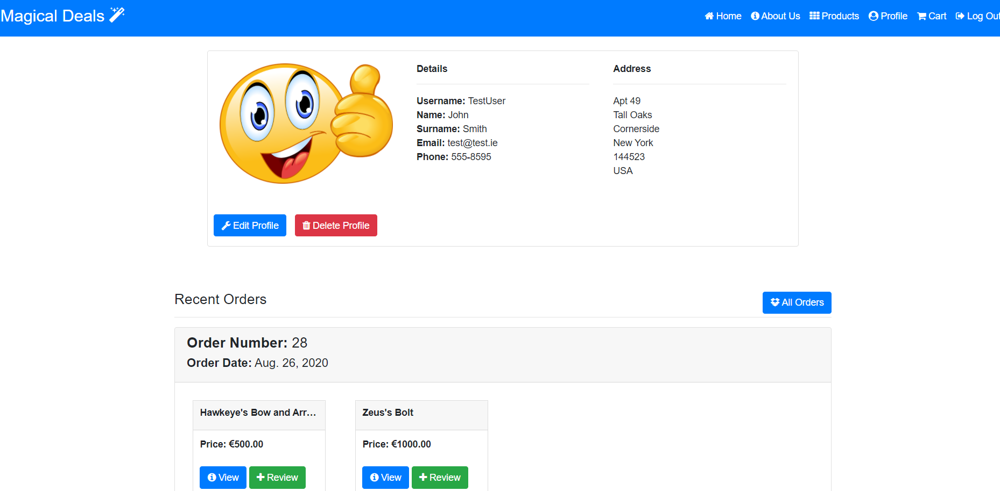
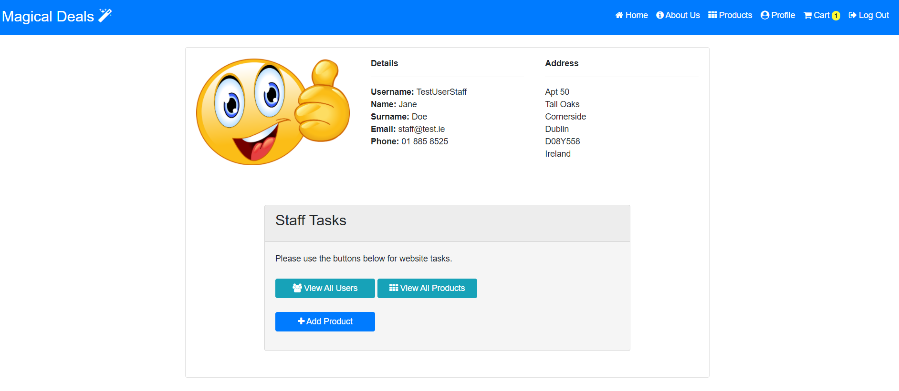
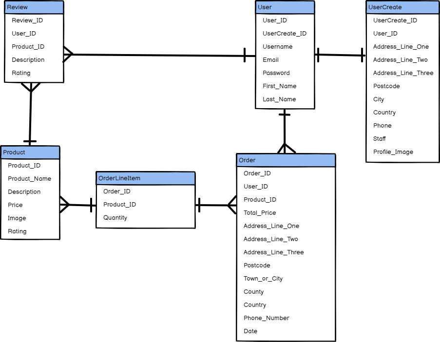

# Magical Deals

Magical Deals is an online store for purchasing high end replicas of famous movie/TV and historical items at magical prices. 

Every day, people all around the world see items on TV and in movies that they would love to own for themselves. Items such as Thor's Hammer and Iron Man's armour are normally only things in comics or in movies, but with Magical Deals we bring these items to life so that users can purchase them at reasonable prices. 

Users are able to create accounts where they will have their very own profile. Here they will be able to view previous orders and reviews they have made for products on the store. They will also be able to purchase items and leave reviews on other items on the website with ease. 

### Deployed at: https://magical-deals.herokuapp.com

## Table of Contents
1. [**UX**](#ux)
    1. [**User Stories**](#user-stories)
        1. [**New Users**](#new-users)
        2. [**Existing Members**](#existing-members)
        3. [**Admin / Staff Users**](#admin-/-staff-users)
    2. [**Wireframes**](#wireframes)
    3. [**Entity Relationship Diagram (ERD)**](#entity-relationship-diagram-(ERD))
2. [**Features**](#features)
    1. [**Existing Features**](#existing-features)
        1. [**Regular Users**](#regular-users)
        2. [**Staff Users**](#staff-users)
    2. [**Future Features**](#future-features)
3. [**Technologies Used**](#technologies-used)
4. [**Testing**](#testing)
    1. [**User Credentials**](#user-credentials)
        1. [**Test User**](#test-user)
        2. [**Test User Staff**](#test-user-staff)
    2. [**Manual**](#manual)
    3. [**Validation**](#validation)
        1. [**CSS**](#CSS)
        2. [**HTML**](#HTML)
        3. [**JavaScript**](#javaScript)
        4. [**Codacy**](#codacy)
    4. [**Automated**](#automated)
        1. [**Travis**](#travis)
        2. [**Django / Coverage**](#django-/-coverage)
            1. [**Test Steps**](#test-steps)
    5. [**Responsiveness**](#responsiveness)
    6. [**Bugs Found**](#bugs-found)
5. [**Deployment**](#deployment)
    1. [**GitHub**](#GitHub)
        1. [**To commit the code on GitPod to GitHub**](#to-commit-the-code-on-GitPod-to-GitHub)
    2. [**Heroku**](#heroku)
6. [**Credits**](#credits)
    1. [**Content**](#content)
    2. [**Media**](#media)
    3. [**Acknowledgements**](#acknowledgements)

## UX
This project was designed to allow users to, through CRUD functionality, manage a collection of products related to TV shows, movies and history. In particular;
- Allows users to create an account through the signup form
- Allows users to edit their accounts details on their profile page
- Allows users to delete their accounts from their profile page

This website is designed for fans of popular fandom who would like a place to purchase items related to their interests as well as leaving reviews for other Magical Deal's members to help them find amazing deals. Searching through thousands of sites daily looking for the perfect gifts for your friends and family (and even yourself!) can be daunting. Magical Deals puts together a wide range of items from a long list of popular franchises and areas of interest so that you can find everything you need in one place with ease. 

I feel that this website satisfies the base requirements in that the users can create, read, update and delete data related to items in the database in an easy to use and visually appealing interface. 

There are a range of apps including Accounts, Cart, Checkout, Home, Products, Reviews and Search that all work together seamlessly to provide a beautifully designed and easy to navigate website that has been designed to appeal to a wide range of visitor types. 

A new user who does not have an account will only have access to the homepage (index.html), the about us page, the signup page, and the login page. They will also be able to view the full details of products that are visible on the homepage, but will be unable to purchase items, leave reviews or view all of the sites products. In place of these buttons and features, the user will see prompts to create an account to access this information. 

Once logged in, the members will have access to the sites remaining functionality for purchasing items, adding, editing and deleting reviews and editing content on their personal profile.

Once logged in, staff members have access to the same functionality as members for testing purposes (as well as potentially allowing staff to purchase items for personal use in future). On top of this, they have access to create new products, edit and delete products and manage users using the staff tasks box. 

### User Stories
#### New Users
- As a new user, I would like to be able to view information about the website so that I can decide whether to use their services or not
- As a new user, I would like to be able to see reasons why I should create an account so that I can decide if I would like to become a members
- As a new user, I would like to be able to view a sample range of items so that I can get an idea of what items the website offers
- As a new user, I would like to be able to view reviews on individual items so that I can see what other users think of the items 
- As a new user, I would like to be able to view examples of items other customers have bought for ideas on what I might want to buy 
- As a new user, I would like to be able to see a site map so that I can navigate to a specific page easier

#### Existing Members
- As an existing member, I would like to be able to reset my password in case I forget my old password so that I can log in to my profile
- As an existing member, I would like to be able to log into my profile easily so that I can review my profile information
- As an existing member, I would like to be able to edit my personal information on my profile so that I can keep the information up to database
- As an existing member, I would like to be able to delete my profile when I am finished with Magical Deals services so that I can protect my data
- As an existing member, I would like to be able to view my recent orders so that I can add reviews to them easily
- As an existing member, I would like to be able to view all of my previous orders so that I can find items that I have previously bought to purchase them again
- As an existing member, I would like to be able to view my recent reviews of items so that I can edit or delete them if neccessary
- As an existing member, I would like to be able to review all of my reviews so that I can find old reviews and edit them with ease
- As an existing member, I would like to be able to see prices on items so that I can find items that I can afford
- As an existing member, I would like to be able to add items to a cart so that I can eventually purchase them
- As an existing member, I would like to be able to view all of the products available on the website 
- As an existing member, I would like to be able to narrow down my search options of the products using keywords to make it easier to find items
- As an existing member, I would like to be able to view my cart and edit/remove items that I have changed my mind about purchasing
- As an existing member, I would like to be able to checkout and provide a different delivery address for my items to be shipped to 
- As an existing member, I would like to be able to checkout and provide a credit card as payment 

#### Admin / Staff Users
- As a staff member, I would like to be able to create new products on the website so that we can increase our offering 
- As a staff member, I would like to be able to edit existing products so that I can change them when neccessary
- As a staff member, I would like to be able to be able to delete items from the store when they are no longer available
- As a staff member, I would like to be able to view all of the users of the website so that I can manage them
- As a staff member, I would like to be able to be able to edit and delete reviews in case they contain any offensive or inappropriate content
- As a staff member, I would like to be able to delete a user from the website in case it is neccessary
- As a staff member, I would like to be able to be able to edit a users information in case it is neccessary
- As a staff member, I would like to be able to be able to grant a user staff access or remove it if neccessary

### Wireframes
As there are many pages to this project, I have included the wireframes in a separate document.

Please see the wireframes.md file for the entire collection of wireframes: https://github.com/aidan-stritch/magical-deals/blob/master/wireframes.md

### Entity Relationship Diagram (ERD)

## Features
### Existing Features
#### Regular Users 
1. Login - The customers are able to create their own accounts and log into the website with secure details.
2. Sign-Up - New users can sign up themselves if they wish to set up an account.
3. User Profile - Each user has their own profile that welcomes them by Username for personalisation.
4. Users can view their order history from their profile
5. Users can view their review history from their profile
6. Users can review any items that they have purchased using a link from their profile or in the individual products page
7. Once logged in, customers can see our full range of products on the products page
8. Users can log out at any time from the store by clicking on the logout button 
9. Users can add items to the cart while browsing the store, from there they can remove the items or checkout using the Stripe payment management system securely and easily
10. Users can search on the products page for items based on name so that they can narrow down their options
11. When creating a profile, it will not allow users to create a profile with the same username as another member

#### Staff Users
1. Create Data - Staff users can add new products to the database using a simple form.
2. Staff and view all users and edit their basic profile information, including making them staff or not
3. Staff can delete any user profile from the all users page
4. Staff can edit and delete products from the store at the click of a button

### Future Features
1. Users will be able to add items to a wishlist that will be visible on their profile so that they can purchase the items at a later data
2. Magical Deals will be able to use data stored from users reviews, search history and order history to provide suggestions in an "our picks for you" section
3. Users will be able to search based on multiple criteria, such as description, keywords and prices
4. Users will be able to sort items on the products page, all orders, all reviews etc by multiple criteria, including date, price, category etc
5. When creating a product, Staff users will be able to include the stock amount which will reduce when orders are made and can be edited/increased through the edit product form. Items out of stock will appear without the ability to add to basket and with a message stating that it is currently out of stock
6. When creating a product, in future releases we will allow currency selection to be an option for buying/selling in other countries
7. Review date and time will be included on the review card view so that users will know if the reviews are recent 
8. When creating / editing an account, the user will be able to select country from a picklist to avoid spelling errors in the database
9. In future releases, userss will be able to store their card information on their profile for faster checkout
10. In future releases, users will be able to include multiple delivery addresses for ease of use
11. An average review score will be included on the product view page and in the product cards on other pages

## Technologies Used
- HTML - This site uses HTML to instruct the browser how to interprit the code correctly and arrange the layout.
- CSS - This site uses CSS to aid in the style, and overall theme of the website
- Bootstrap - This site uses Bootstrap elements to help design the framework of the site
- Django - This was the chosen framework for developing the project
- Python - This language was chosen to code the a large amount of the functionality of the site
- JavaScript - this was used to program some of the features on the site, such as the calendar
- Balsamiq - This was used to create the wireframes in the design phase
- Heroku - This was chosen to host the website app for deployment.
- Stripe - This was used to process the credit card payments in the checkout app
- Travis - This was used to handle the continuous integration
- Coverage - This reporting tool was installed and used to produce reports showing how much of the apps had been tested
- Amazon AWS - S3 Buckets were set up and used for storing website images and files
- Postgres - This Relational Datatabase was used to handle the data storage

## Testing
### User Credentials
There are two main uses on this site; a site member and a site staff member. Please use the logins below to access and review both user types:

#### Test User
- Username: TestUser
- Email Address: test@test.ie
- Password: test

#### Test User Staff
- Username: TestUserStaff
- Email Address: staff@test.ie
- Password: test

### Manual
As there are many pages for the Magical Deals website which had to be manually tested to ensure functionality and UX were correct, they have been included in a separate file to avoid taking up too much space on the README.md documentation.

Please see the manual_testing.md file for the full breakdown of the manual testing done for this site. You can use this link to reach the file: https://github.com/aidan-stritch/magical-deals/blob/master/manual_testing.md

During this process, several issues were discovered which have been since fixed on the site. Some examples of these include; 
- When a customer adds a product with a negative value it accepts it and is created 
- On forms the required fields were not clearly defined for users to be aware
- Guidelines on site (such as list of tips for creating products) were not consistently handled by CSS
- Error message for invalid fields on form submission were not clearly visible
- Some fields that are not neccessary on the user create form are marked as mandatory (e.g. Address Line Three). This was changed. 
- Product Search box on Products.html page was too small for UX. This was resized.
- Some button labels did not clearly define what it does (e.g. "Add" instead of "Add to Cart")

There are other issues that could not be fixed due to ability / time contraints that have been included in the "Bugs Found" section below. 

### Validation
#### CSS
The custom.css file code was validated using the The W3C CSS Validation Service and the image below verifies that the code was successfully validated with no errors. 

    

#### HTML
All HTML pages have been checked using the W3C Markup Validation Service and have reported no errors. As this tool does not recognise several Django symbols (such as ), the validation service does not report as 100% no issues and no image is available as in above CSS validation section. 

In order to avoid this, the page source code was used for testing, however the tool pointed to several small issues on some pages that were of no consequence, such as opening p tags not being found for a closing /p tag, when they were present in the code. All issues found, such as alt being missing from some img links have been corrected. 

#### JavaScript
JS Hint was used to ensure that the JavaScript used in the website had no errors.

#### Codacy
The Codacy.com app was used to inspect the entire projects code and product a report on each page of any errors in layout, duplication etc. The majority of issues have been corrected, however there are errors reported linked to keywords and built in terms for files which cannot be changed. All files have been assessed and the only errors which remain are deemed to be acceptable and the result is a B. As a part of this report, Codacy provides a Codacy quality badge which is included below: 

### Automated
#### Travis
Travis Continuous Integration was used to run tests on the code every time a push is made to GitHub so that errors could be flagged and managed in an efficient manner. 

The build status tool below shows that the website is working efficiently. 

#### Django / Coverage
Django tests were written and Coverage was used to product detailed reports to ensure the sites apps were tested as much as possible. The results for each of the sites apps can be found here: https://github.com/aidan-stritch/magical-deals/blob/master/testing_results.md 

The overall coverage rate for the entire sites apps is currently at 86% from a total of 50 tests. At a later date, more testing for the views.py files in particular will be needed to increase the coverage rate to 100% to ensure that the website is functioning correctly. However, between the Django tests and the manual testing done, the website does not show any errors or major bugs, other than those listed in the "Bugs Found" section below.

##### Test Steps
In order to run tests on GitPod using coverage (which has been installed to handle testing), please follow the below steps in the terminal on GitPod:
1. Run the following code (changing "APPNAME" to the name of the app you want to test): "coverage run --source=APPNAME manage.py test"
    - This will run a test on all test.py files in the app and product a detailed list of any errors or failures or return "OK" if all tests are passing

2. In the terminal, use: "coverage report"
    - generates a detailed report showing what has/what needs testing

3. In order to product a html report which allows you to inspect in each file, to see in easy to use colour codes the lines of code which have been tested or which have not yet been tested, please use the following command: "coverage html"

### Responsiveness
This website has been designed to scale correctly to different screen sizes with no issues on layout. In order to ensure that the view was pleasant to the user, certain divs and items had to be arranged differently or hidden/shown depending on screen size. This was handled using CSS media queries.

In order to ensure that the navigation bar was as responsive as possible, on Desktop the menu shows accross the top of the page while on mobile screens, the menu reduced to a burger icon with only the title visible. When the burger icon is clicked, a side menu appears with the links to other pages from the nav bar. 

Each page was altered slightly between mobile and desktop for its layout to ensure that the user is getting the best UX possible, regardless of the screen size they are using. This can be seen in the wireframes section as I have included a wireframe of each page with desktop and mobile view. 
### Bugs Found
- When an item is on the database with a negative price (this has since been corrected), an unhandled error appears when attempting to checkout "/app/.heroku/python/lib/python3.6/site-packages/stripe/api_requestor.py in handle_error_response, line 152". This bug should be investigated and handled on the offchance that an item is added in error with a negative price
- UserCreate object names are not valid for ease of use for admin users. This will need to be addressed
- Address not saving on orders correctly. Currently using the users stored address

## Deployment
This project was deployed to Heroku at the address https://magical-deals.herokuapp.com/ using the following steps

### GitHub:
- Create a new project on GitHub
- Copy the code for pushing to a GitHub repository and paste in the terminal of your project on GitPod (git remote add origin 'link')

#### To commit the code on GitPod to GitHub:
- In the terminal, type "git add ." to add all new changes to the code to staging area
- Next, type "git status" to see which files are ready to be commited
- Commit these by typing "git commit -m" and adding a detailed description of the commit in ""
- Next, push the code commit to GitHub by typing "git push -u origin master"

### Heroku:
- Create a Heroku account
- Create a new app
- Link the Heroku app with your GitHub repository
- Push changes to git using the terminal and verify that the connection to Heroku is working
- Add environment variables to Heroku settings.

## Credits
### Content
- Font icons imported from FontAwesome. 
### Media
As there are many images for the products in this website, I have included the links to the images in a separate document.

Please see the media_files.md file for the entire collection of links: https://github.com/aidan-stritch/magical-deals/blob/master/media_files.md

### Acknowledgements
- I would like to acknowledge my mentor Anthony Ngene for all of his help and advice with this project
- I would like to thank my friends and family for their testing help and advice with this project
- I would like to also thank the Code Insitute Tutor's for all of their help with some of the trickier functionality in this project. In particular, Tim and Samantha, who have been a massive help.